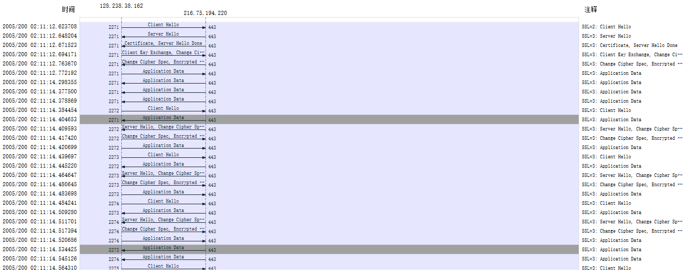

# SSL  
## Important notes  
An Ethernet frame may contain one or more SSL records, which is very different from the case in HTTP, where each frame contains either one complete HTTP message or a portion of a HTTP message.  
SSL provides a simple API witch sockets, which is similar to TCP's API. When an application wants to employ SSL, the application includes SSL classes/libraries.  
Although SSL technically resides in the application layer, from the developer's perspective it's a transport-layer protocol.  
In order not to check the integrity at the other link end, SSL breaks the data stream into records, appends a MAC to each record for integrity check, and then encrypts the record + MAC.  
To avoid attack like reverse order, removing segments or replaying segment, SSL include the current sequence number in the process of calculating the MAC key.  
The SSL record consists of a type field, version field, length field, data field, and MAC field. Note that the first three fields are not encrypted. The type field indicates whether the record is a handshake message or an application data message. It's also used to close the SSL connection.  
SSL uses nonces to defend against the "connection replay attack" and sequence numbers to defend against replaying individual packets during an ongoing session.  
1. For each of the first 8 Ethernet frames, specify the source of the frame (client or server), determine the number of SSL records that are included in the frame, and list the SSL record types that are included in the frame. Draw a timing diagram between client and server, with one arrow for each SSL record.  
1: client, 1, client hello.  
2: server, 1, server hello.  
3: server, 2, both are handshake.  
4: client, 3, handshake, change cipher spec, handshake.  
5: server, 2, change cipher spec, handshake.  
6: client, 1, application data.  
7: server, 1, application data.  
8: server, 1, application data.  
  
2. Each of the SSL records begins with the same three fields (with possibly different values). One of these fields is “content type” and has length of one byte. List all three fields and their lengths.  
content type: 1 byte  
version (major/minor): 2 bytes  
length: 2 bytes.  
3. Expand the ClientHello record. (If your trace contains multiple ClientHello records, expand the frame that contains the first one.) What is the value of the content type?  
0x16, which stands for handshake.  
4. Does the ClientHello record contain a nonce (also known as a “challenge”)? If so, what is the value of the challenge in hexadecimal notation?  
Yes, it's 0x66df784c048cd60435dc448989469909.  
5. Does the ClientHello record advertise the cyber suites it supports? If so, in the first listed suite, what are the public-key algorithm, the symmetric-key algorithm, and the hash algorithm?  
Yes.  
public-key algorithm: RSA  
symmetric-key algorithm: RC4  
hash algorithm:  MD5  
6. Locate the ServerHello SSL record. Does this record specify a chosen cipher suite? What are the algorithms in the chosen cipher suite?  
Yes.  
public-key algorithm: RSA  
symmetric-key algorithm: RC4  
hash algorithm:  MD5  
7. Does this record include a nonce? If so, how long is it? What is the purpose of the client and server nonces in SSL?  
Yes.  
32 bytes.  
It's used to prevent connection replay attack.  
*Other information from the solution: 4 bytes in the nonce are time, the rest 28 bytes are data.*  
8. Does this record include a session ID? What is the purpose of the session ID?  
Yes. It's used  to indicates that the server is willing to resume this SSL session using the same SSL parameters and cipher suites negotiated in the first hand-shake.  
9. Does this record contain a certificate, or is the certificate included in a separate record. Does the certificate fit into a single Ethernet frame?  
No, it's included in a separate record.  
No, its length is bigger than the MTU of Ethernet.  
10. Locate the client key exchange record. Does this record contain a pre-master secret? What is this secret used for? Is the secret encrypted? If so, how? How long is the encrypted secret?  
Yes. It's used to calculate the master secret. It's encrypted with RSA. Its length is 128 bytes.  
*Answer from the solution: the message is encrypted with the server public key extracted from the certificate sent from the server.*  
11. What is the purpose of the Change Cipher Spec record? How many bytes is the record in your trace?  
It's used to signal transitions in ciphering strategies. 1 byte.  
*Answer from the solution: the length is 6 bytes, including the header.*  
12.	In the encrypted handshake record, what is being encrypted? How?  
All the handshake messages that were sent by the client. It's encrypted with RC4.  
*Answer from the solution: what is being encrypted is the MAC of the concatenation of the all the handshake messages sent by the client.*  
13.	Does the server also send a change cipher record and an encrypted handshake record to the client? How are those records different from those sent by the client?  
Yes. The content of the encrypted handshake message is different.  
14. How is the application data being encrypted? Do the records containing application data include a MAC? Does Wireshark distinguish between the encrypted application data and the MAC?  
It' encrypted with RC4. It's optional, so I am not sure whether it's included or not. Wireshark doesn't distinguish these two, because the length is the sum of these two, so Wireshark doesn't know where the MAC begins.  
15.	Comment on and explain anything else that you found interesting in the trace.  
The first Client Hello message is different from all the following client hello messages in format.  
*Answer from the solution: The version of SSL used changes from SSLv2 in the initial ClientHello message to SSLv3 in all following message exchanges.Also, during resumes the handshake process is slightly different from the initial one.  The client does not need another certificate so the server never sends it. It just has to send a new nonce followed by Change Cipher Spec and Encrypted Handshake records from the server to client. After a response from the client then application data can be sent.*  
