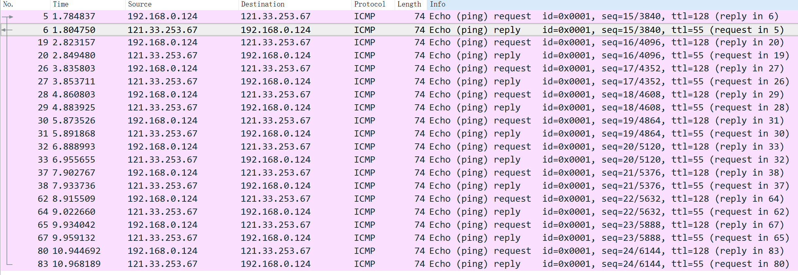
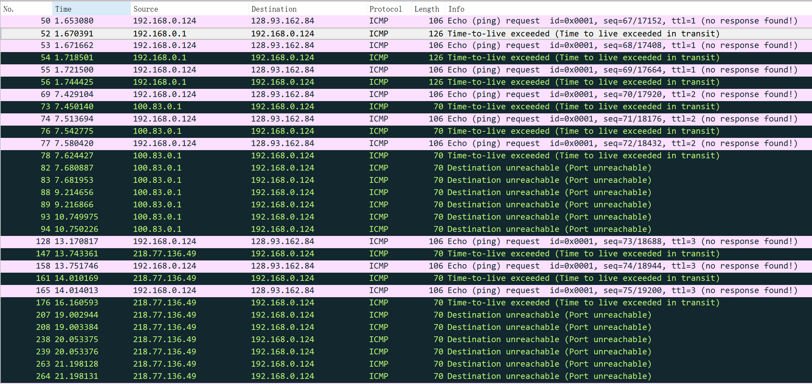
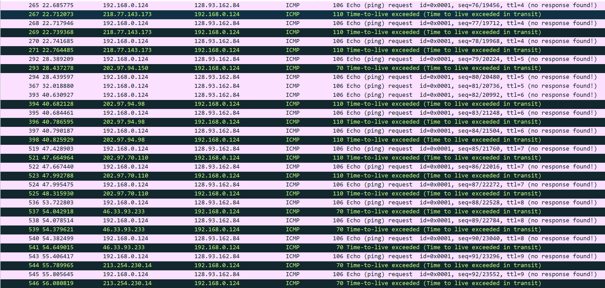
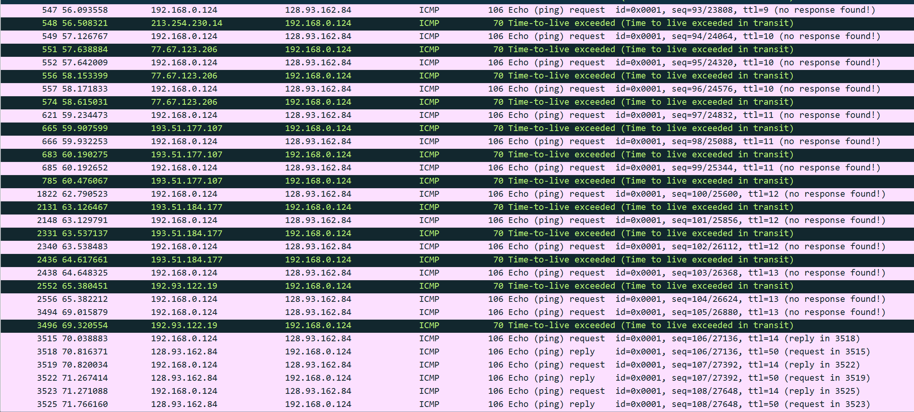

# ICMP  
## Important notes
All ICMP packets have an 8-byte header and variable-sized data section. The first 4 bytes of the header have fixed format, while the last 4 bytes depend on the type and code of that ICMP packet.  
ICMP error messages contain a data section that includes a copy of the entire IPv4 header, plus at least the first eight bytes of data from the IPv4 packet that caused the error message.  
The maximum length of ICMP error messages is 576 bytes.   
  
1. What is the IP address of your host? What is the IP address of the destination host?  
192.168.0.124, 121.33.253.67.  
2. Why is it that an ICMP packet does not have source and destination port numbers?  
Because ICMP is a transport layer protocol, and it doesn't depend on TCP or UDP.  
*Other reasons from the solution: ICMP was designed to communicate network-layer information between hosts and routers, not between application layer processes. Since the network software itself interprets all ICMP messages, no port numbers are needed to direct the ICMP message to an application layer process.*  
3. Examine one of the ping request packets sent by your host. What are the ICMP type and code numbers? What other fields does this ICMP packet have? How many bytes are the checksum, sequence number and identifier fields?  
ICMP type: 8, which stands for Echo request.  
ICMP code number: 0.  
It also has identifier field and sequence number field.  
The length of the fields are all 2 bytes.  
4. Examine the corresponding ping reply packet. What are the ICMP type and code numbers? What other fields does this ICMP packet have? How many bytes are the checksum, sequence number and fields?  
ICMP type: 0, which stands for Echo reply.  
ICMP code number: 0.  
It also has identifier field and sequence number field.  
The length of the fields are all 2 bytes.  
  
  
    
5. What is the IP address of your host? What is the IP address of the target destination host?  
192.168.0.124, 128.93.162.84.  
6. If ICMP sent UDP packets instead (as in Unix/Linux), would the IP protocol number still be 01 for the probe packets? If not, what would it be?  
NO. It will be 17, which stands for UDP.  
7. Examine the ICMP echo packet in your screenshot. Is this different from the ICMP ping query packts in the first half of this lab? If yes, how so?  
No. The echo request packet has exactly the same fields.  
8. Examine the ICMP error packet in your screenshot. It has more fields than the ICMP echo packet. What is included in those fields?  
It contains a IPv4 header and the first 8 bytes of the original ICMP echo request message.  
9. Examine the last three ICMP packets received by the source host. How are these packets different from the ICMP error packets? Why are they different?  
They are normal echo reply packets from the destination, not time-to live exceeded packets. Because the trace process enters the final step, the ttl in the packets sent by the source is big enough for it to arrive at the destination.  
10. Within the tracert measurements, is there a link whose delay is significantly longer than others? Refer to the screenshot in Figure4, is there a link whose delay is significantly longer than others? On the basis of the router names, can you guess the location of the two routers on the end of this link?  
No.  
Yes, the link between the 9th router and the 10th router along the path.  After google, I find out the routers locate in France.    
