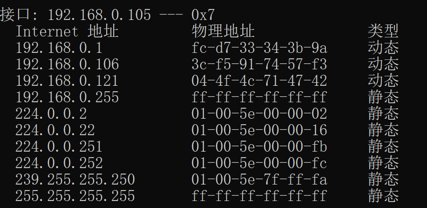

# Ethernet and ARP
1. What is the 48-bit Ethernet address of your computer?  
f0:6e:0b:cd :f1:cb.  
2. What is the 48-bit destination address in the Ethernet frame? Is this Ethernet address of gaia.cs.umass.edu? What device has this as its Ethernet address?  
fc:d7:33:34:3b:9a.  
No.  
The gateway of my computer.  
3. Give the hexadecimal value for the two-byte Frame type field. What upper layer protocol does this correspond to?  
Its value is 0x0800, which correspond to the IPv4 protocol.  
4. How many bytes from the very start of the Ethernet frame does the ASCII "G" in "GET" appear in the Ethernet frame?  
55\.  
5. What is the value of the Ethernet source address? Is this the address of your computer, or of gaia.cs.umass.edu. What device has this as its Ethernet address?  
fc:d7:33:34:3b:9a.  
Neither.  
The gateway of my computer.  
6. What is the destination address in the Ethernet frame? Is this the Ethernet address of your computer?  
f0:6e:0b:cd :f1:cb.  
Yes.  
7. Give the hexadecimal value for the two-byte Frame type field. What upper layer protocol does this correspond to?  
0x0800.  
IPv4.  
8. How many bytes from the very start of the Ethernet frame does the ASCII "O" in "OK" (i.e., the HTTP response code) appear in the Ethernet frame?  
68\.  
9. Write down the contents of your computer's ARP cache. What is the meaning of each column value?  
  
The first column is the Internet address, the second column is the corresponding Mac address, and the last column specifies its type.  
10. What are the hexadecimal values for the source and destination addresses in the Ethernet frame containing the ARP request message?  
source: fc:d7:33:34:3b:9a.  
destination: ff:ff:ff:ff:ff:ff.  
11. Give the hexadecimal value for the two-byte Ethernet Frame type field. What upper layer protocol does this correspond to?  
0x0806, which corresponds to ARP.  
12. Download the ARP specification.  
	* How many bytes from the very beginning of the Ethernet frame does the ARP *opcode* field begin?  
21\.  
	* What is the value of the *opcode* field within the ARP-payload part of the Ethernet frame in which an ARP request is made?  
0x0001.  
	* Does the ARP message contain the IP address of the sender?  
Yes.  
	* Where in the ARP request does the "question" appear- the Ethernet address of the machine whose corresponding IP address is being queried?  
In the target Mac address field which is set to 00:00:00:00:00:00.    
13. Now find the ARP reply that ws sent in response to the ARP request.  
	* How many bytes from the very beginning of the Ethernet frame does the ARP *opcode* field begin?  
21\.  
	* What is the value of the *opcode* field within the ARP-payload part of the Ethernet frame in which an ARP repsonse is made?  
0x0002.  
	* Where in the ARP message does the "answer: to the earlier ARP request appear- the IP address of the machine having the Ethernet address whose corresponding IP address is being queried?  
In the sender Mac address field.  
14. What are the hexadecimal values for the source and destination address in the Ethernet frame containing the ARP reply message?  
source: 00:06:25:da:af:73.  
destination: 00:d0:59:a9:3d:68.  
15. Open the *ethernet-ethereal-tarce-1* tarce file. The first and second ARP packets in this trace correspond to an ARP request sent by the computer running Wireshark, and the ARP reply sent to the computer running Wireshark by the computer with the ARP-requested Ethernet address. But there is yet another computer on this network, as indicated by packet 6- another ARP request. Why is there no ARP reply (sent in response to the ARP request i packet 6) in the packet trace?  
Maybe because this is no device whose IP address is 192.168.1.117.  
*Solution: There is no reply in this trace, because we are not at the machine that sent the
request. The ARP request is broadcast, but the ARP reply is sent back directly
to the sender’s Ethernet address.*  
16. What is the default amount of time that an entry remains in your ARP cache before being removed. You can determine this empirically (by monitoring the cache contents) or by looking this up in your operation system documentation. Indicate how/where you determined this value.  
33.5s.
Use the following steps to find out the ARP age timeout threshold in win10.  
Run `net interface ipv4 show interfaces`  
Get the interface ID for the required interface.  
Run `netsh interface ipv4 show interface <interface ID>`  
See the "Reachable Time".  
