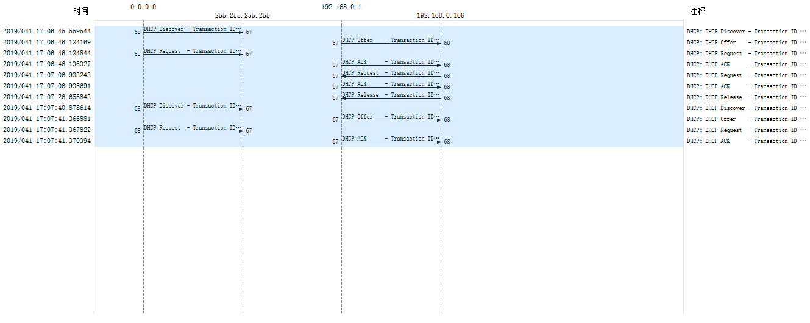

# DHCP  
## Important notes
	* DHCP format  
CIAddr: The client puts its own current IP address in this field if and only if it has a valid IP address while in the BOUND, RENEWING or REBINDING states; otherwise, it sets the field to 0. The client can only use this field when its address is actually valid and usable, not during the process of acquiring an address. Specifically, the client does not use this field to request a particular IP address in a lease; it uses the Requested IP Address DHCP option.  
YIAddr: The IP address that the server is assigning to the client.  
SIAddr: The meaning of this field is slightly changed in DHCP. In BOOTP, it is the IP address of the BOOTP server sending a BOOTREPLY message. In DHCP, it is the address of the server that the client should use for the next step in the bootstrap process, which may or may not be the server sending this reply. The sending server always includes its own IP address in the Server Identifier DHCP option.  
GIAddr: This field is used just as it is in BOOTP, to route BOOTP messages when BOOTP relay agents are involved to facilitate the communication of BOOTP requests and replies between a client and a server on different subnets or networks. See the topic on DHCP relaying. As with BOOTP, this field is not used by clients and does not represent the server giving the client the address of a default router (that's done using the Router DHCP option).  
1. Are DHCP messages sent over UDP or TCP?  
UDP.  
2. Draw a timing datagram illustrating the sequence of the first four-packet Discover/Offer/Request/ACK DHCP exchange between the client and server. For each packet, indicated the source and destination port numbers. Are the port numbers the same as in the example given in this lab assignment?  
  
Discover: source port 68, dst port 67.  
Offer: source port 67, dst port 68.  
Request: source port 68, dst port 67.  
ACK: source port 67, dst port 68.  
Yes.  
3. What is the link-layer (e.g., Ethernet) address of your host?  
f0:6e:0b:cd :f1:cb.  
4. What values in the DHCP discover message differentiate this message from the DHCP request message?  
The "DHCP Message Type" field in the options is 0x01, which stands for DHCP discover.  
5. What is the value of the Transaction-ID in each of the first four (Discover/Offer/Request/ACK) DHCP messages? What are the value of the Transaction-ID in the second set (Request/ACK) set of DHCP messages? What is the purpose of the Transaction-ID field?  
0xbd9ada66, 0x2b50f313. 
The Transaction-ID field is generated by the client to allow it to match up the request with replies received from DHCP servers.  
6. A host uses DHCP to obtain an IP address, among other things. But a host's IP address is not set until the end of the four-message exchange, then what values are used in the IP datagrams in the four-message exchange? For each of the four DHCP messages (Discover/Offer/Request/ACK DHCP), indicate the source and destination IP addresses that are carried in the encapsulating IP datagram.  
0.0.0.0.  
Discover: 0.0.0.0, 255.255.255.255.  
Offer: 192.168.0.1, 192.168.0.106.  
Request: 0.0.0.0, 255.255.255.255.  
ACK: 192.168.0.1, 192.168.0.106.  
7. What is the IP address of your DHCP server?  
192.168.0.1.  
8. What IP address is the DHCP server offering to your host in the DHCP Offer message? Indicate which DHCP message contains the offered DHCP address.  
192.168.0.106. It's contained in the Offer and ACK messages.  
9. In the example screenshot in this assignment, there is no relay agent between the host and the DHCP server. What values in the trace indicate the absence of a relay agent? Is there a relay agent in your experiment? If so what is the IP address of the agent?  
The Relay agent IP address is 0.0.0.0. No.  
10. Explain the purpose of the router and subnet mask lines in the DHCP offer message.  
The router specifies the IP address of the default gateway.  
The subnet mask specifies the subnet mask of the LAN that the host is in.  
11. In the DHCP trace file noted in footnote2, the DHCP server offers a specific IP address to the client (see also question 8. abover). In the client's response to the first server OFFER message, does the client accept this IP address? Where in the client's RESPONSE is the client's requested address?  
Yes. In the option field "Requested IP Address".  
12. Explain the purpose of the lease time. How long is the lease time your experiment?  
It tells the client how long the IP address allocated is valid. 7200s.  
13. What is the purpose of the DHCP release message? Does the DHCP server issue an acknowledgment of receipt of the client's DHCP request? What would happen fi the client's DHCP release message is lost?  
It tells the server the client doesn't need the IP address allocated before any more.  
No.  
The client gives up its IP address, while the server thinks it's still being occupied.  
*Other answers from the solution: the DHCP server would have to wait unti the lease preiod is over for that IP address until it could reuse it for another client.*   
14. Clear the *bootp* filter from your Wireshark window. Were any ARP packets sent or received during the DHCP packet-exchange period? If so, explain the purpose of those ARP packets.  
Yes. The server issues an ARP request for the offered IP to make sure the IP address is not already used.   
